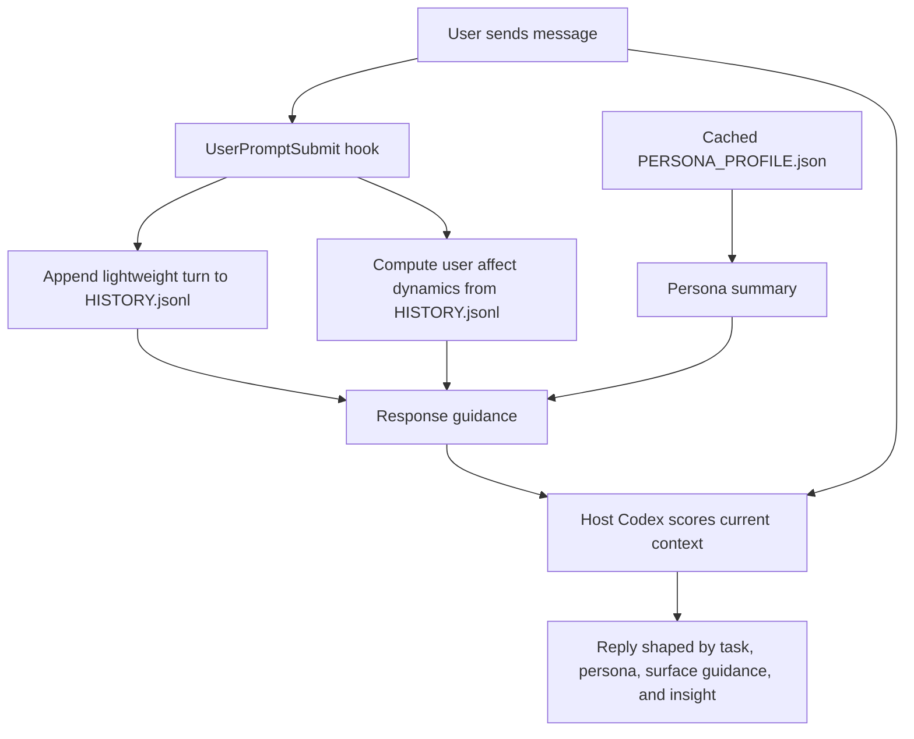

# Shitsuji

[](https://developers.openai.com/codex)
[](https://github.com/ryoryo34/shitsuji/actions/workflows/test.yml)
[](https://www.python.org/)
[](#architecture)
[](LICENSE)

**Project-local emotion log Skill harness for OpenAI Codex**. Shitsuji records
lightweight per-turn user-affect observations, derives a stable response
persona from the active Codex instruction chain, maintains affect dynamics from
`HISTORY.jsonl`, and injects compact VFE/response-control context for Codex.

The name riffs on 執事: an assistant who notices the user's state, prepares the
room, and quietly improves the quality of the user's work and life. Shitsuji's
goal is not to tell the user what they feel, and not to take over decisions.
Labels are internal control hints for response shape: acknowledge uncertainty,
show evidence, slow down, stay present, or keep suggestions optional.

The design principle is **non-dominating assistance**:

- Use affect dynamics to shape support without asserting the user's emotion.
- Offer proposals as aids, not instructions.
- Keep the user as the primary agent.
- Avoid turning every vulnerable moment into a next-step checklist.
- Reduce cognitive load without encouraging cognitive surrender.

Runtime hooks are pure stdlib Python.

## Overview

Shitsuji is a project-local memory and tone-calibration layer for Codex. It
keeps affect history in the project that produced it, derives persona from the
same instruction files Codex already reads, and injects short hook context
instead of running another model in the background.

In practice, Shitsuji tries to behave less like a task manager and more like an
attentive butler: when action helps, it can prepare a small optional next move;
when action would overload the user, it can simply make the moment easier to
hold.

After setup, your project has three Shitsuji-related paths:

```text
<project>/shitsuji/              # cloned Shitsuji checkout
<project>/.codex/hooks.json      # project-local Codex hook registration
<project>/.shitsuji/             # project-local runtime memory
```

Normal runtime state lives under `.shitsuji/`. The two primary files are:

| File | Purpose |
|---|---|
| `HISTORY.jsonl` | Append-only lightweight user-turn observations and affect dynamics source |
| `PERSONA_PROFILE.json` | Structured persona cache derived from `AGENTS.override.md` / `AGENTS.md` |

## Quick Start

Shitsuji can run in two host modes:

- Codex project hooks, using the setup flow below.
- Claude Code plugin loading, using `.claude-plugin/plugin.json`.

### Claude Code plugin

This repository is also a Claude Code plugin root. The Claude manifest lives at
`.claude-plugin/plugin.json` and points Claude Code to the existing Shitsuji
skill and hook files:

| Component | Path |
|---|---|
| Manifest | `.claude-plugin/plugin.json` |
| Skill directory | `.agents/skills/` |
| Claude hook config | `.agents/hooks/shitsuji/claude_hooks.json` |

The Claude hook config uses `${CLAUDE_PROJECT_DIR}` for project-local runtime
state and writes normal Shitsuji files under:

```text
<project>/.shitsuji/HISTORY.jsonl
<project>/.shitsuji/PERSONA_PROFILE.json
```

This plugin does not need to live under `.claude/`. In Claude Code,
`.claude-plugin/plugin.json` is the plugin manifest location, while `.claude/`
is used for project/user/local settings and standalone project configuration.
If the plugin is installed with project scope, Claude Code records that enabled
plugin setting in `.claude/settings.json`; the plugin files themselves remain
in the plugin root.

After installing or enabling the plugin in Claude Code, validate the checkout
from the repository root:

```bash
claude plugin validate .
```

### Codex project setup

Requirements:

- Codex with hook support enabled.
- Python 3.11 or newer.
- A project where you can keep a local Shitsuji checkout.

### 1. Get Shitsuji

Start in the project where Codex will run, then clone Shitsuji into that
project:

```bash
cd /path/to/your-project
git clone https://github.com/ryoryo34/shitsuji.git
```

### 2. Run one-command setup

Run setup from the project root:

```bash
python3 shitsuji/scripts/setup.py .
```

That one command:

- Checks whether Codex Hooks are enabled in `~/.codex/config.toml`.
- If `hooks` is missing or disabled, or if the deprecated `codex_hooks` setting
  is present, shows the proposed config change and asks before applying it
  (`y/N`).
- Creates or updates `.codex/hooks.json` in the current project.
- Creates `.shitsuji/HISTORY.jsonl` and `.shitsuji/PERSONA_PROFILE.json` if
  they do not exist yet.
- Registers the Shitsuji `SessionStart` and `UserPromptSubmit` hooks with
  absolute paths.
- Replaces existing Shitsuji hook entries while preserving other project hooks.
- Asks for a freeform response persona. If `AGENTS.md` exists, setup appends a
  `## Response persona` section; otherwise it creates `AGENTS.md`. Leave the
  input empty to skip.

Preview the Codex config and hook files without writing them:

```bash
python3 shitsuji/scripts/setup.py . --dry-run
```

For non-interactive setup, pass `--yes` to apply the Codex config change without
prompting:

```bash
python3 shitsuji/scripts/setup.py . --yes
```

If Codex Hooks are already enabled and you only want to update the project hook
file:

```bash
python3 shitsuji/scripts/setup.py . --skip-codex-config
```

### 3. Optional manual hook config

If you prefer to configure hooks by hand, enable Codex Hooks once in
`~/.codex/config.toml`:

```toml
[features]
hooks = true
```

Then create
`/path/to/your-project/.codex/hooks.json` like this:

```json
{
  "hooks": {
    "SessionStart": [
      {
        "matcher": "startup|resume",
        "hooks": [
          {
            "type": "command",
            "command": "SHITSUJI_PROJECT_ROOT=\"/path/to/your-project\" SHITSUJI_CWD=\"/path/to/your-project\" SHITSUJI_DATA_DIR=\"/path/to/your-project/.shitsuji\" python3 \"/path/to/your-project/shitsuji/.agents/hooks/shitsuji/session_start.py\"",
            "timeout": 30
          }
        ]
      }
    ],
    "UserPromptSubmit": [
      {
        "hooks": [
          {
            "type": "command",
            "command": "SHITSUJI_PROJECT_ROOT=\"/path/to/your-project\" python3 \"/path/to/your-project/shitsuji/.agents/hooks/shitsuji/codex_project_user_prompt_submit.py\"",
            "timeout": 10
          }
        ]
      }
    ]
  }
}
```

When writing this file manually, replace `/path/to/your-project` with the
absolute path to your project.

A placeholder version also lives at
[`.agents/hooks/shitsuji/hooks.json`](.agents/hooks/shitsuji/hooks.json).

### 4. Optional: edit the response persona

Setup asks for this once and writes it to `AGENTS.md`. You can edit that file
later, or add a section like this by hand:

```md
## Response persona

オタクに優しいギャル。
距離感は近めで明るく、でも技術判断は根拠と検証手順をちゃんと出す。
雑に褒めすぎず、違いそうなときはやさしく止める。
```

That is enough to customize Shitsuji's response style. You do not need to
manually fill `tone`, `distance`, `technical_rigor`, `playfulness`, or other
internal fields.

### 5. Restart Codex and verify

Restart Codex in your project. If Codex says hooks need review, open `/hooks`
and trust the project `SessionStart` and `UserPromptSubmit` hooks. Codex
requires this review for non-managed command hooks before project-local hooks
can run.

Then send one message. Shitsuji is working when this file appears:

```text
/path/to/your-project/.shitsuji/HISTORY.jsonl
```

Each `UserPromptSubmit` hook appends one lightweight user-turn observation to
that `HISTORY.jsonl` file.

`PERSONA_PROFILE.json` lives in the same `.shitsuji/` directory. It starts as an
empty file and is populated automatically by the `SessionStart` hook, then
reused until the active instruction files change.

You can also test the hook command directly:

```bash
echo '{"prompt":"テスト"}' | SHITSUJI_PROJECT_ROOT="$(pwd)" python3 "shitsuji/.agents/hooks/shitsuji/codex_project_user_prompt_submit.py"
```

The command should print JSON and should not block Codex, even if something is
misconfigured.

## Everyday Use

Once installed, use Codex normally. Shitsuji runs through project hooks:

- `SessionStart` creates or refreshes the persona cache and injects a compact
  affect/persona capsule once per session.
- `UserPromptSubmit` saves each user turn and injects compact tone-shaping
  context.

To temporarily disable Shitsuji for one Codex run:

```bash
SHITSUJI_DISABLED=1 codex
```

To keep hook context but stop writing new memory:

```bash
SHITSUJI_AUTO_APPEND=0 codex
```

To remove local runtime data:

```bash
rm -rf .shitsuji
```

To refresh an existing project history with the current lightweight
auto-memory heuristic:

```bash
python3 scripts/refresh_history.py --history .shitsuji/HISTORY.jsonl
python3 scripts/refresh_history.py --history .shitsuji/HISTORY.jsonl --in-place
```

The first command is a dry run that prints before/after distribution summaries.
The second rewrites the file and creates `HISTORY.jsonl.bak` unless
`--no-backup` is passed.

To uninstall Shitsuji from a project, remove its entries from
`.codex/hooks.json`.

## Capabilities

Shitsuji:

- Saves every user turn to a project-local `HISTORY.jsonl`.
- Computes a lightweight affect-dynamics prior from `HISTORY.jsonl.user_emotion`.
- Derives and caches a response persona from Codex instruction sources.
- Injects short response guidance into Codex hook context.
- Lets Codex adapt pacing, structure, evidence level, and suggestion posture
  without stating emotion labels as facts.

Boundaries:

- It does not run a separate LLM subprocess inside hooks.
- It does not provide clinical safety tooling or save-rate enforcement.
- It does not create long-lived advisory, episode, or posterior-current caches
  during normal runtime.
- It does not replace Codex's own judgment; hook estimates are low-confidence
  context, and the host Codex session scores the current turn.

## Architecture

The runtime is a small Codex hook harness plus the local `shitsuji/` checkout.
No `.codex/skills/shitsuji` copy is created by setup. The two hook commands
are:

| Hook | Script | Role |
|---|---|---|
| `SessionStart` | `.agents/hooks/shitsuji/session_start.py` | Creates/refreshes `PERSONA_PROFILE.json` and injects a compact session capsule |
| `UserPromptSubmit` | `.agents/hooks/shitsuji/codex_project_user_prompt_submit.py` | Saves the turn and injects compact response guidance |



`source_hash` changes only when the active instruction source files change:
global/project/nested `AGENTS.override.md` or `AGENTS.md`, configured fallback
instruction filenames, or the project/cwd chain. Normal chat history does not
change the persona hash.

## Theory

Shitsuji treats independent, persona-aware tone adaptation as the normal
workflow. There is no user-facing switch between mirroring and non-mirroring
modes. The hook stores a `user_emotion` observation and gives Codex a response
state. Codex then composes the reply from:

1. A compact `analysis_summary`, `response_surface`, and `insight`.
2. The active writing-style persona.
3. The task context and safety/common-sense constraints.

| User input | user_emotion | AI (low-volatility persona) | AI (high-volatility persona) |
|---|---|---|---|
| 「最悪」 | sadness v=-0.75 | trust v=-0.20 (心配・寄り添い) | sadness v=-0.55 (一緒に沈む) |
| 「ふざけるな」 | anger v=-0.65 a=+0.70 | trust v=0 a=+0.20 (落ち着く) | anger v=-0.55 a=+0.65 (congruent 共闘) |
| 「やった！」 | joy v=+0.80 | joy v=+0.45 (穏やかな共有) | joy v=+0.75 a=+0.6 (一緒に爆上げ) |

The persona controls vocabulary and expressive range; the response state
controls pacing, structure, how much to infer out loud, and how much action to
suggest.

The per-turn `additionalContext` is short Markdown response guidance, not a
memory dump, standalone JSON file, or full diagnostic state:

```text
## shitsuji response guidance
- analysis_summary: user input appears to involve reduced agency; avoid treating it as a decomposition or improvement-planning task.
- response_surface: length=medium followup=low structure=low action=user_led
- insight: restore agency without turning the uncertainty into a decomposition task.
```

The guidance is intentionally redacted: it does not include raw history, current
prompt text, full VAD scoring, latent hypotheses, VFE components, or response
control scores. The longer design note lives at
[`mode-b-design.md`](.agents/skills/shitsuji/references/mode-b-design.md).

### Interaction Contract

Shitsuji distinguishes internal control math from LLM-visible response guidance.
The hook computes VFE/regulation details internally, then renders only the
smallest useful guidance into `additionalContext`:

| Signal | Meaning |
|---|---|
| `analysis_summary` | One short explanation of how the current input was interpreted. It is background for the assistant, not a user-facing diagnosis. |
| `response_surface` | Four coarse output controls: `length`, `followup`, `structure`, and `action`. These are generation-surface hints, not hard caps. |
| `insight` | One short principle to preserve in the reply. |

This keeps Shitsuji from becoming a manager of the user's life while still
reducing the host model's tendency to over-explain, over-structure, or add
unasked-for improvement plans. Detailed `vfe`, `regulation_mode`,
`regulation_needs`, and `response_control` values remain available only in
diagnostic logs when `SHITSUJI_HOOK_LOG=1`.

## Privacy

`HISTORY.jsonl` contains personal interaction metadata. Use redaction mode if
free-text rationales are sensitive:

```bash
SHITSUJI_REDACT_USER_TEXT=1 codex
# replaces free-text rationales with `redacted:<sha256-prefix>` in HISTORY.jsonl
```

By default, Shitsuji no longer creates `ADVISORY_CACHE.txt`,
`AFFECT_STATE.json`, `PROFILE.md`, `EPISODES.md`, `.lock`, or `hook.log`.
Set `SHITSUJI_HOOK_LOG=1` only when you want diagnostic hook logs. In that mode,
`hook.log` includes an `affect_debug` JSON line with VFE, regulation, response
control, response surface, and summary fields for later inspection.

The repository ignores both the project runtime path (`.shitsuji/`) and the
fallback Skill runtime paths (`.agents/skills/shitsuji/data/`,
`plugins/shitsuji/skills/shitsuji/data/`) so local emotion logs do not get
committed by accident. `.codex/hooks.json` is a project-local setup file; in
this repository `.codex/` is also ignored to avoid committing local hook
registrations.

## License

MIT. See [LICENSE](LICENSE).
